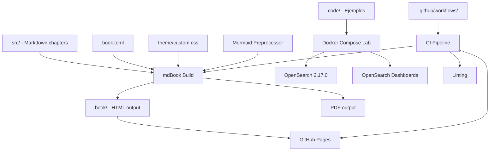
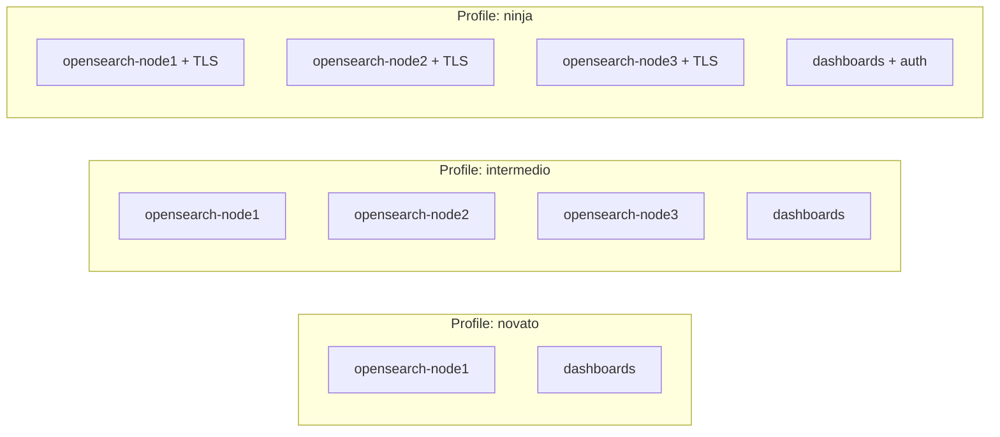

# Design Document

## Overview

Este documento define la arquitectura técnica del proyecto "OpenSearch: Macizo y Conciso". Cubre la estructura del repositorio, el sistema de build con mdBook, la infraestructura de laboratorio con Docker Compose, el pipeline de CI/CD, y la organización del contenido.

El diseño prioriza reproducibilidad, automatización, y una experiencia de contribución simple para el autor.

## Architecture

### Diagrama de Componentes del Sistema



### Estructura del Repositorio

```
opensearch_macizo/
├── book.toml                    # Configuración mdBook
├── src/                         # Código fuente Markdown del libro
│   ├── SUMMARY.md               # Tabla de contenidos
│   ├── prefacio.md              # Prefacio + "¿Es este libro para ti?"
│   ├── mapa-progresion.md       # Mapa de progresión por capítulos
│   ├── parte-1/                 # Nivel Novato (caps 1-5)
│   │   ├── ch01-que-es-opensearch.md
│   │   ├── ch02-laboratorio.md
│   │   ├── ch03-crud-rest-api.md
│   │   ├── ch04-mappings-analizadores.md
│   │   └── ch05-puente-novato-intermedio.md
│   ├── parte-2/                 # Nivel Intermedio (caps 6-12)
│   │   ├── ch06-query-dsl-avanzado.md
│   │   ├── ch07-agregaciones.md
│   │   ├── ch08-estrategias-indexacion.md
│   │   ├── ch09-ingest-pipelines.md
│   │   ├── ch10-rendimiento-busqueda.md
│   │   ├── ch11-clientes-oficiales.md
│   │   └── ch12-puente-intermedio-ninja.md
│   ├── parte-3/                 # Nivel Ninja (caps 13-18)
│   │   ├── ch13-arquitectura-produccion.md
│   │   ├── ch14-seguridad.md
│   │   ├── ch15-observabilidad-otel.md
│   │   ├── ch16-ml-busqueda-vectorial.md
│   │   ├── ch17-siem-alerting.md
│   │   └── ch18-optimizacion-cierre.md
│   └── apendices/
│       ├── glosario-bilingue.md
│       ├── cheatsheet-api.md
│       ├── referencia-query-dsl.md
│       ├── troubleshooting.md
│       └── recursos-comunidad.md
├── code/                        # Ejemplos de código ejecutables
│   ├── docker-compose.yml       # Lab base con profiles
│   ├── README.md                # Requisitos del sistema host
│   ├── dashboards-setup/        # Scripts de config Dashboards
│   ├── ch01/
│   ├── ch02/
│   ├── ...
│   └── ch18/
├── theme/
│   └── custom.css               # Tema CSS personalizado
├── .github/
│   └── workflows/
│       ├── build.yml            # Validación en PRs
│       └── deploy.yml           # Deploy a GitHub Pages
├── .gitignore
└── README.md                    # Instrucciones del proyecto
```

## Components and Interfaces

### 1. Sistema de Build — mdBook

#### book.toml

```toml
[book]
title = "OpenSearch: Macizo y Conciso"
authors = ["Alex Mercado"]
language = "es"
src = "src"

[build]
build-dir = "book"

[preprocessor.mermaid]
command = "mdbook-mermaid"

[output.html]
additional-css = ["theme/custom.css"]
git-repository-url = "https://github.com/mercadoalex/opensearch_macizo"

[output.html.fold]
enable = true

[output.pdf]
command = "mdbook-pdf"
```

**Decisiones de diseño:**
- Se usa `mdbook-mermaid` como preprocesador para diagramas inline
- Se usa `mdbook-pdf` para generación PDF (ambos formatos se generan en un solo `mdbook build`)
- El tema CSS personalizado en `theme/custom.css` se inyecta vía `additional-css`
- Si cualquier preprocesador o backend falla, mdBook propaga el exit code != 0

#### SUMMARY.md

```markdown
# Summary

[Prefacio](prefacio.md)
[Mapa de Progresión](mapa-progresion.md)

# Parte I — Novato

- [¿Qué es OpenSearch?](parte-1/ch01-que-es-opensearch.md)
- [Tu Primer Laboratorio](parte-1/ch02-laboratorio.md)
- [CRUD con la REST API](parte-1/ch03-crud-rest-api.md)
- [Mappings y Analizadores](parte-1/ch04-mappings-analizadores.md)
- [Puente: De Novato a Intermedio](parte-1/ch05-puente-novato-intermedio.md)

# Parte II — Intermedio

- [Query DSL Avanzado](parte-2/ch06-query-dsl-avanzado.md)
- [Agregaciones](parte-2/ch07-agregaciones.md)
- [Estrategias de Indexación](parte-2/ch08-estrategias-indexacion.md)
- [Ingest Pipelines](parte-2/ch09-ingest-pipelines.md)
- [Rendimiento de Búsqueda](parte-2/ch10-rendimiento-busqueda.md)
- [Clientes Oficiales](parte-2/ch11-clientes-oficiales.md)
- [Puente: De Intermedio a Ninja](parte-2/ch12-puente-intermedio-ninja.md)

# Parte III — Ninja

- [Arquitectura de Producción](parte-3/ch13-arquitectura-produccion.md)
- [Seguridad](parte-3/ch14-seguridad.md)
- [Observabilidad con OTEL](parte-3/ch15-observabilidad-otel.md)
- [ML y Búsqueda Vectorial](parte-3/ch16-ml-busqueda-vectorial.md)
- [SIEM y Alerting](parte-3/ch17-siem-alerting.md)
- [Optimización y Cierre](parte-3/ch18-optimizacion-cierre.md)

# Apéndices

- [Glosario Bilingüe](apendices/glosario-bilingue.md)
- [Cheatsheet REST API](apendices/cheatsheet-api.md)
- [Referencia Query DSL](apendices/referencia-query-dsl.md)
- [Troubleshooting](apendices/troubleshooting.md)
- [Recursos y Comunidad](apendices/recursos-comunidad.md)
```

### 2. Laboratorio Docker Compose

#### Arquitectura de Perfiles



#### docker-compose.yml (esquema)

```yaml
version: "3.9"

services:
  opensearch-node1:
    image: opensearchproject/opensearch:2.17.0
    profiles: ["novato", "intermedio", "ninja"]
    environment:
      - cluster.name=opensearch-macizo
      - node.name=opensearch-node1
      - discovery.type=single-node  # override en multi-nodo
      - OPENSEARCH_INITIAL_ADMIN_PASSWORD=${OPENSEARCH_INITIAL_ADMIN_PASSWORD:-Admin123!}
    ports:
      - "9200:9200"
    volumes:
      - opensearch-data1:/usr/share/opensearch/data
    healthcheck:
      test: ["CMD-SHELL", "curl -sk https://localhost:9200/_cluster/health || exit 1"]
      interval: 10s
      timeout: 5s
      retries: 12

  opensearch-node2:
    image: opensearchproject/opensearch:2.17.0
    profiles: ["intermedio", "ninja"]
    environment:
      - cluster.name=opensearch-macizo
      - node.name=opensearch-node2
      - discovery.seed_hosts=opensearch-node1,opensearch-node3
      - cluster.initial_cluster_manager_nodes=opensearch-node1,opensearch-node2,opensearch-node3

  opensearch-node3:
    image: opensearchproject/opensearch:2.17.0
    profiles: ["intermedio", "ninja"]
    environment:
      - cluster.name=opensearch-macizo
      - node.name=opensearch-node3
      - discovery.seed_hosts=opensearch-node1,opensearch-node2
      - cluster.initial_cluster_manager_nodes=opensearch-node1,opensearch-node2,opensearch-node3

  dashboards:
    image: opensearchproject/opensearch-dashboards:2.17.0
    profiles: ["novato", "intermedio", "ninja"]
    ports:
      - "5601:5601"
    environment:
      - OPENSEARCH_HOSTS=["https://opensearch-node1:9200"]
    depends_on:
      opensearch-node1:
        condition: service_healthy

  dashboards-setup:
    image: curlimages/curl:latest
    profiles: ["novato", "intermedio", "ninja"]
    depends_on:
      dashboards:
        condition: service_started
    volumes:
      - ./dashboards-setup:/setup
    entrypoint: ["/bin/sh", "/setup/init.sh"]

volumes:
  opensearch-data1:
  opensearch-data2:
  opensearch-data3:
```

**Decisiones de diseño:**
- Un solo `docker-compose.yml` con profiles en vez de múltiples archivos Compose
- Healthcheck integrado: el lector no necesita verificar manualmente
- Servicio `dashboards-setup` carga index patterns y dashboards de ejemplo automáticamente
- Versión fija `2.17.0` para reproducibilidad
- Perfil `ninja` agrega configuración TLS via bind-mount de certificados en `code/certs/`

#### Requisitos del Host (code/README.md)

| Perfil      | Docker Engine | Docker Compose | RAM mínima |
|-------------|--------------|----------------|------------|
| novato      | ≥ 24.0       | ≥ 2.20         | 4 GB       |
| intermedio  | ≥ 24.0       | ≥ 2.20         | 8 GB       |
| ninja       | ≥ 24.0       | ≥ 2.20         | 12 GB      |

### 3. Ejemplos de Código

#### Convención por Capítulo

```
code/ch03/
├── README.md              # Instrucciones del capítulo
├── 01-create-index.sh     # curl: crear índice
├── 02-index-document.sh   # curl: indexar documento
├── 03-search.sh           # curl: búsqueda básica
├── 04-update.sh           # curl: actualizar documento
├── 05-delete.sh           # curl: eliminar documento
├── sample-data.json       # Datos de prueba
└── load-data.sh           # Script para cargar datos
```

**Convenciones:**
- Prefijo numérico `NN-` para orden de ejecución
- Extensiones: `.sh` para curl/httpie, `.py` para Python, `.go` para Go, `.yml` para configs
- Cada script incluye comentario con la respuesta esperada
- `README.md` por capítulo documenta prerequisitos y orden de ejecución
- Si hay dependencias Python: `requirements.txt` con versiones pinned
- Si hay dependencias Go: `go.mod` + `go.sum`

#### Referencia desde el Libro

En el Markdown del capítulo, los ejemplos se referencian así:

```markdown
> 📁 Código fuente: [`code/ch03/01-create-index.sh`](../code/ch03/01-create-index.sh)
```

### 4. Pipeline CI/CD

#### Workflow: build.yml (Validación en PRs)

```yaml
name: Build & Validate
on:
  push:
    branches: [main]
  pull_request:
    branches: [main]

jobs:
  build:
    runs-on: ubuntu-latest
    steps:
      - uses: actions/checkout@v4
      
      - name: Install mdBook
        run: |
          cargo install mdbook mdbook-mermaid mdbook-pdf
      
      - name: Build book
        run: mdbook build
      
      - name: Lint code examples
        run: |
          # Lint shell scripts
          find code/ -name "*.sh" -exec shellcheck {} + || true
          # Lint Python
          find code/ -name "*.py" -exec python -m py_compile {} + || true
          # Lint YAML
          find code/ -name "*.yml" -o -name "*.yaml" | xargs yamllint || true
        continue-on-error: true  # Linting no bloquea merge
```

#### Workflow: deploy.yml (Deploy a GitHub Pages)

```yaml
name: Deploy to GitHub Pages
on:
  push:
    branches: [main]

permissions:
  pages: write
  id-token: write

jobs:
  deploy:
    runs-on: ubuntu-latest
    environment:
      name: github-pages
      url: ${{ steps.deployment.outputs.page_url }}
    steps:
      - uses: actions/checkout@v4
      
      - name: Install mdBook
        run: cargo install mdbook mdbook-mermaid mdbook-pdf
      
      - name: Build book
        run: mdbook build
      
      - name: Upload artifact
        uses: actions/upload-pages-artifact@v3
        with:
          path: book/
      
      - name: Deploy to GitHub Pages
        id: deployment
        uses: actions/deploy-pages@v4
```

**Decisiones de diseño:**
- Build y deploy separados: PRs solo validan, merge a main despliega
- Linting usa `continue-on-error: true` — reporta pero no bloquea (Req 9.7)
- mdBook build SIN `continue-on-error` — fallo de compilación bloquea merge (Req 9.5)
- Si deploy falla, GitHub Pages mantiene la última versión estable automáticamente

### 5. Tema CSS Personalizado

```css
/* theme/custom.css */

:root {
    --macizo-primary: #005EB8;    /* Azul OpenSearch */
    --macizo-accent: #FF9900;     /* Naranja acento */
    --macizo-bg: #1a1a2e;         /* Fondo oscuro */
    --macizo-text: #e0e0e0;       /* Texto claro */
}

/* Estilo "macizo" - tipografía densa y legible */
.content {
    font-family: 'JetBrains Mono', 'Fira Code', monospace;
    line-height: 1.6;
    max-width: 48rem;
}

/* Callouts para opiniones del autor */
blockquote.opinion {
    border-left: 4px solid var(--macizo-accent);
    background: rgba(255, 153, 0, 0.1);
    padding: 1rem;
}

/* Referencia a código fuente */
blockquote.code-ref {
    border-left: 4px solid var(--macizo-primary);
    font-size: 0.85em;
}
```

## Data Models

### Estructura de un Capítulo (Modelo de Contenido)

Cada capítulo sigue esta estructura Markdown:

```markdown
# Título del Capítulo

> **Opinión del autor:** [Opinión opinionada sobre el tema]

## Objetivo

[1-2 oraciones sobre qué aprenderá el lector]

## Prerequisitos

- Capítulo N: [concepto requerido]

## Contenido

### Sección 1
[Contenido técnico con ejemplos inline]

> 📁 Código fuente: [`code/chNN/archivo.sh`](ruta)

### Sección 2
[...]

## Cuándo Usar y Cuándo NO

| ✅ Usar cuando... | ❌ NO usar cuando... |
|---|---|
| ... | ... |

## Ejercicios

1. [Ejercicio práctico]
2. [Ejercicio práctico]

## Resumen

[3-5 bullets con los conceptos clave]
```

### Mapa de Progresión (Modelo de Datos)

```markdown
| Cap | Título | Temas | Prerequisitos |
|-----|--------|-------|---------------|
| 1   | ¿Qué es OpenSearch? | Historia, arquitectura, casos de uso | Ninguno |
| 2   | Tu Primer Laboratorio | Docker, cluster health, Dashboards | Cap 1 |
| ... | ... | ... | ... |
```

## Correctness Properties

### Property 1: Reproducibilidad del Laboratorio
**Validates: Requirements 7.1, 7.2**
- Para todo perfil P ∈ {novato, intermedio, ninja}, ejecutar `docker compose --profile P up` en una máquina que cumpla los requisitos mínimos SIEMPRE produce un clúster con `_cluster/health` respondiendo status green o yellow dentro del timeout especificado.

### Property 2: Ejecutabilidad de Ejemplos
**Validates: Requirements 6.2, 6.3**
- Para todo Ejemplo_Código E en `code/chNN/`, ejecutar E contra el Laboratorio en perfil correspondiente produce la salida documentada sin errores.

### Property 3: Integridad del Build
**Validates: Requirements 8.2, 8.6**
- `mdbook build` con la configuración en `book.toml` termina con exit code 0 si y solo si todos los archivos .md referenciados en SUMMARY.md existen y tienen sintaxis Markdown válida, y todos los bloques mermaid son parseables.

### Property 4: Consistencia de Referencias
**Validates: Requirements 6.7**
- Para todo capítulo C que referencia un archivo `code/chNN/archivo.ext`, dicho archivo existe en el repositorio.

### Property 5: Cobertura del Glosario
**Validates: Requirements 10.1**
- Para todo término técnico T que aparece por primera vez en un capítulo, T tiene una entrada en el glosario bilingüe del Apéndice.

## Error Handling

| Componente | Error | Comportamiento |
|------------|-------|---------------|
| mdBook build | Markdown inválido | Exit code != 0, mensaje identifica archivo y línea |
| mdBook build | Mermaid malformado | Exit code != 0, preprocesador reporta bloque problemático |
| mdBook build | PDF falla | Exit code != 0, incluso si HTML se generó correctamente |
| Docker Compose | Nodo no levanta | Healthcheck falla, `docker compose up` no reporta healthy |
| Docker Compose | Timeout healthcheck | Servicio marcado como unhealthy tras 12 reintentos (2 min) |
| CI build | mdBook falla | Check de estado fallido, merge bloqueado |
| CI linting | Errores de sintaxis | Reportado en logs, merge NO bloqueado |
| CI deploy | GitHub Pages falla | Error en workflow, versión anterior se mantiene |

## Testing Strategy

1. **Build validation**: `mdbook build` en CI verifica integridad de todos los .md y bloques mermaid
2. **Code linting**: shellcheck, py_compile, yamllint sobre `code/` — informativo, no bloqueante
3. **Lab smoke test**: Script en CI que levanta perfil `novato`, espera healthcheck, ejecuta un curl básico, y destruye el entorno
4. **Link checking**: Verificar que todas las referencias `code/chNN/archivo` existen (script custom en CI)
5. **Glosario coverage**: Script que extrae términos en negrita de capítulos y verifica existencia en glosario

## Considerations

### Alternativas Evaluadas

| Decisión | Opción elegida | Alternativa descartada | Razón |
|----------|---------------|----------------------|-------|
| Generador | mdBook | Hugo, Sphinx | Consistencia con eBPF Macizo, ecosistema Rust, simplicidad |
| Lab | Docker Compose profiles | Múltiples compose files | Un solo archivo, menos confusión para el lector |
| PDF | mdbook-pdf | Pandoc post-proceso | Integración nativa con mdBook, un solo comando |
| CI | GitHub Actions | GitLab CI | El repo está en GitHub, zero config |
| Diagramas | Mermaid inline | PlantUML, draw.io | Vive en el Markdown, no requiere archivos externos |
| Versión OS | 2.17.0 fija | Latest | Reproducibilidad > actualidad |

### Limitaciones Conocidas

1. **mdbook-pdf** puede tener problemas con caracteres Unicode en español (tildes, ñ). Mitigation: probar PDF en CI con cada build.
2. **Docker Compose profiles** requiere Docker Compose v2.20+. Lectores con versiones anteriores necesitarán actualizar.
3. **Mermaid rendering** en PDF no está soportado nativamente por mdbook-pdf. Mitigation: los diagramas se renderizan como imágenes estáticas SVG para el output PDF.

### Seguridad

- El perfil `ninja` usa certificados TLS auto-firmados almacenados en `code/certs/` (solo para laboratorio, NO para producción)
- Los certificados están en `.gitignore` y se generan con un script `code/certs/generate.sh`
- Las contraseñas por defecto del lab son explícitamente marcadas como "SOLO PARA DESARROLLO"
