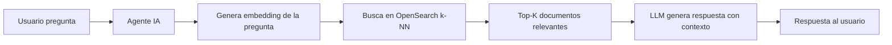
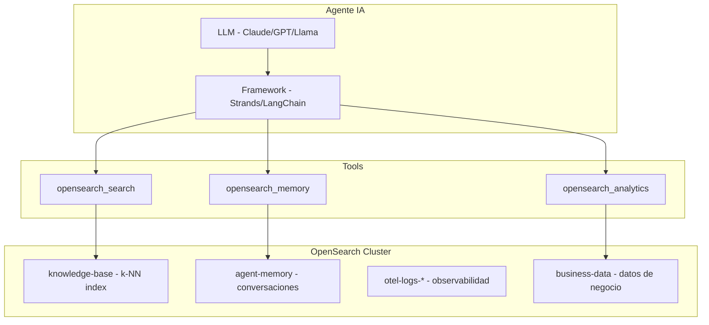

# OpenSearch como Backend de Agentes IA

> **Opinión del autor:** Los agentes de IA necesitan memoria, contexto y herramientas. OpenSearch cubre las tres: búsqueda vectorial para RAG, índices para memoria persistente, y una REST API que cualquier framework de agentes puede invocar como tool. Si ya operas un clúster OpenSearch, ya tienes el 70% de la infraestructura que un agente necesita para ser útil.

## Por Qué OpenSearch para Agentes

Los agentes de IA (LangChain, Strands, CrewAI, AutoGen) necesitan acceder a conocimiento externo porque los LLMs tienen un corte de entrenamiento y no conocen tus datos privados. El patrón dominante es RAG (Retrieval-Augmented Generation):



OpenSearch es ideal para esto porque combina:
- **Búsqueda vectorial** (k-NN) para similitud semántica
- **Búsqueda textual** (BM25) para keywords exactos
- **Búsqueda híbrida** para lo mejor de ambos mundos
- **Filtros** para restringir por metadata (fecha, tenant, categoría)
- **Escalabilidad** para millones de documentos sin degradación

## Patrón 1: RAG (Retrieval-Augmented Generation)

El flujo completo de un agente con RAG sobre OpenSearch:

### Indexación del conocimiento

```python
from opensearchpy import OpenSearch
from sentence_transformers import SentenceTransformer

client = OpenSearch(
    hosts=[{"host": "localhost", "port": 9200}],
    http_auth=("admin", "Admin123!"),
    use_ssl=True, verify_certs=False,
)

model = SentenceTransformer("all-MiniLM-L6-v2")  # dim=384

# Crear índice con campo vectorial
client.indices.create("knowledge-base", body={
    "settings": {"index.knn": True},
    "mappings": {
        "properties": {
            "text": {"type": "text", "analyzer": "spanish"},
            "embedding": {
                "type": "knn_vector",
                "dimension": 384,
                "method": {"name": "hnsw", "space_type": "cosinesimil", "engine": "lucene"}
            },
            "source": {"type": "keyword"},
            "category": {"type": "keyword"},
            "timestamp": {"type": "date"}
        }
    }
})

# Indexar documentos con embeddings
docs = [
    "OpenSearch soporta búsqueda vectorial con k-NN desde la versión 1.2",
    "ISM permite automatizar el ciclo de vida de índices con políticas declarativas",
    "Data Prepper es el pipeline recomendado para ingesta de datos OTEL",
]

for i, text in enumerate(docs):
    embedding = model.encode(text).tolist()
    client.index("knowledge-base", body={
        "text": text,
        "embedding": embedding,
        "source": "opensearch-docs",
        "category": "technical",
        "timestamp": "2024-03-15T00:00:00Z"
    }, id=str(i))
```

### Retrieval para el agente

```python
def retrieve_context(query: str, k: int = 5, category: str = None) -> list[str]:
    """Busca documentos relevantes para el agente."""
    query_embedding = model.encode(query).tolist()

    # Búsqueda híbrida: vectorial + textual
    body = {
        "size": k,
        "query": {
            "bool": {
                "should": [
                    {"knn": {"embedding": {"vector": query_embedding, "k": k, "boost": 0.7}}},
                    {"match": {"text": {"query": query, "boost": 0.3}}}
                ]
            }
        }
    }

    # Filtro opcional por categoría
    if category:
        body["query"]["bool"]["filter"] = [{"term": {"category": category}}]

    response = client.search(index="knowledge-base", body=body)
    return [hit["_source"]["text"] for hit in response["hits"]["hits"]]
```

### Integración con un LLM

```python
import boto3

def ask_agent(question: str) -> str:
    """Agente RAG: retrieval + generación."""
    # 1. Retrieve
    context_docs = retrieve_context(question, k=3)
    context = "\n".join(context_docs)

    # 2. Generate
    prompt = f"""Responde basándote SOLO en el contexto proporcionado.
Si la información no está en el contexto, di "No tengo información sobre eso".

Contexto:
{context}

Pregunta: {question}
Respuesta:"""

    # Ejemplo con Bedrock (Claude)
    bedrock = boto3.client("bedrock-runtime", region_name="us-east-1")
    response = bedrock.invoke_model(
        modelId="anthropic.claude-3-haiku-20240307-v1:0",
        body=json.dumps({"messages": [{"role": "user", "content": prompt}], "max_tokens": 500})
    )
    return json.loads(response["body"].read())["content"][0]["text"]
```

> 📁 Código fuente: [`code/agentes-ia/01-rag-opensearch.py`](../../code/agentes-ia/01-rag-opensearch.py)

## Patrón 2: OpenSearch como Tool de un Agente

Los frameworks de agentes permiten definir "tools" que el LLM puede invocar. OpenSearch es una tool natural:

```python
# Definición de tool para LangChain / Strands
def opensearch_search_tool(query: str, index: str = "knowledge-base") -> str:
    """Busca información en la base de conocimiento OpenSearch.
    
    Args:
        query: Texto de búsqueda
        index: Índice donde buscar
    
    Returns:
        Documentos relevantes encontrados
    """
    results = retrieve_context(query, k=3)
    return "\n---\n".join(results) if results else "No se encontraron resultados."


def opensearch_analytics_tool(index: str, field: str, metric: str = "avg") -> str:
    """Ejecuta una agregación sobre un índice OpenSearch.
    
    Args:
        index: Índice sobre el cual agregar
        field: Campo numérico para la agregación
        metric: Tipo de métrica (avg, sum, min, max)
    """
    body = {"size": 0, "aggs": {"result": {metric: {"field": field}}}}
    response = client.search(index=index, body=body)
    value = response["aggregations"]["result"]["value"]
    return f"El {metric} de '{field}' en '{index}' es: {value}"
```

El agente decide cuándo usar cada tool basándose en la pregunta del usuario. "¿Qué dice la documentación sobre ISM?" → `opensearch_search_tool`. "¿Cuál es el precio promedio de productos?" → `opensearch_analytics_tool`.

> 📁 Código fuente: [`code/agentes-ia/02-tools.py`](../../code/agentes-ia/02-tools.py)

## Patrón 3: Memoria Conversacional Persistente

Los agentes necesitan memoria de conversaciones pasadas. OpenSearch es un backend eficiente para esto:

```python
def store_conversation(session_id: str, role: str, content: str):
    """Almacena un mensaje en la memoria del agente."""
    embedding = model.encode(content).tolist()
    client.index("agent-memory", body={
        "session_id": session_id,
        "role": role,  # "user" o "assistant"
        "content": content,
        "embedding": embedding,
        "timestamp": datetime.utcnow().isoformat()
    })


def recall_relevant_memory(session_id: str, current_query: str, k: int = 5) -> list[str]:
    """Recupera mensajes pasados relevantes a la query actual."""
    query_embedding = model.encode(current_query).tolist()
    body = {
        "size": k,
        "query": {
            "bool": {
                "must": [{"knn": {"embedding": {"vector": query_embedding, "k": k}}}],
                "filter": [{"term": {"session_id": session_id}}]
            }
        },
        "sort": [{"timestamp": "desc"}]
    }
    response = client.search(index="agent-memory", body=body)
    return [f"{hit['_source']['role']}: {hit['_source']['content']}" 
            for hit in response["hits"]["hits"]]
```

A diferencia de memoria en RAM (que se pierde al reiniciar), la memoria en OpenSearch:
- Persiste entre sesiones y reinicios del agente
- Escala a millones de interacciones sin degradación
- Permite búsqueda semántica sobre conversaciones pasadas (no solo las últimas N)
- Soporta multi-tenancy con filtros por `session_id` o `user_id`

## Patrón 4: Agente de Observabilidad

Un agente que investiga incidentes consultando logs, traces y métricas en OpenSearch:

```python
def investigate_incident(service: str, timeframe: str = "1h") -> str:
    """Agente que investiga un incidente buscando en logs y traces."""
    
    # Buscar errores recientes del servicio
    errors = client.search(index="otel-logs-*", body={
        "size": 10,
        "query": {"bool": {"filter": [
            {"term": {"service": service}},
            {"term": {"level": "error"}},
            {"range": {"@timestamp": {"gte": f"now-{timeframe}"}}}
        ]}},
        "sort": [{"@timestamp": "desc"}]
    })
    
    # Buscar traces lentos
    slow_traces = client.search(index="otel-v1-apm-span-*", body={
        "size": 5,
        "query": {"bool": {"filter": [
            {"term": {"serviceName": service}},
            {"range": {"durationInNanos": {"gte": 5000000000}}},  # > 5s
            {"range": {"startTime": {"gte": f"now-{timeframe}"}}}
        ]}},
        "sort": [{"durationInNanos": "desc"}]
    })
    
    return {
        "errors": [hit["_source"]["message"] for hit in errors["hits"]["hits"]],
        "slow_traces": [
            {"trace_id": hit["_source"]["traceId"], "duration_ms": hit["_source"]["durationInNanos"] / 1e6}
            for hit in slow_traces["hits"]["hits"]
        ]
    }
```

Este patrón es poderoso combinado con un LLM: el agente busca evidencia en OpenSearch y el modelo genera un análisis de root cause.

## Arquitectura Recomendada



## Consideraciones de Producción

| Aspecto | Recomendación |
|---------|--------------|
| Modelo de embedding | `all-MiniLM-L6-v2` (384 dim) para empezar. Migra a 768+ si necesitas más precisión |
| Chunk size | 256-512 tokens por documento. Demasiado largo diluye la relevancia |
| Top-K | 3-5 documentos para contexto. Más de 10 satura el prompt del LLM |
| Actualización | Re-indexa embeddings si cambias de modelo. Los vectores no son portables |
| Latencia | k-NN con Lucene engine: < 50ms para < 1M vectores. Escala con Faiss para más |
| Costos | El embedding se genera una vez al indexar. La búsqueda es solo vector math |

## Cuándo Usar y Cuándo NO

| ✅ Usar OpenSearch para agentes... | ❌ NO usar cuando... |
|---|---|
| Ya tienes datos en OpenSearch que el agente necesita consultar | Tu knowledge base es < 100 documentos (un JSON en memoria basta) |
| Necesitas búsqueda híbrida (texto + semántica) | Solo necesitas vector search puro sin filtros (usa Pinecone/Weaviate) |
| Quieres memoria conversacional persistente y buscable | La conversación es efímera y no necesita persistir |
| El agente necesita analytics (aggregations) sobre datos | El agente solo necesita generar texto, no consultar datos |
| Operas en infraestructura propia (no quieres SaaS de vectores) | El presupuesto permite un vector DB managed sin complejidad operativa |

## Resumen

- OpenSearch combina búsqueda vectorial, textual e híbrida en un solo backend — ideal para RAG
- Como "tool" de un agente, OpenSearch expone search y analytics vía REST API
- La memoria conversacional en OpenSearch persiste, escala, y permite recall semántico
- El patrón más robusto es: embedding al indexar → k-NN + BM25 al buscar → contexto al LLM
- Un solo clúster OpenSearch puede servir como knowledge base, memoria, y fuente de observabilidad para agentes
- Chunk size de 256-512 tokens y top-K de 3-5 son los defaults razonables para empezar
