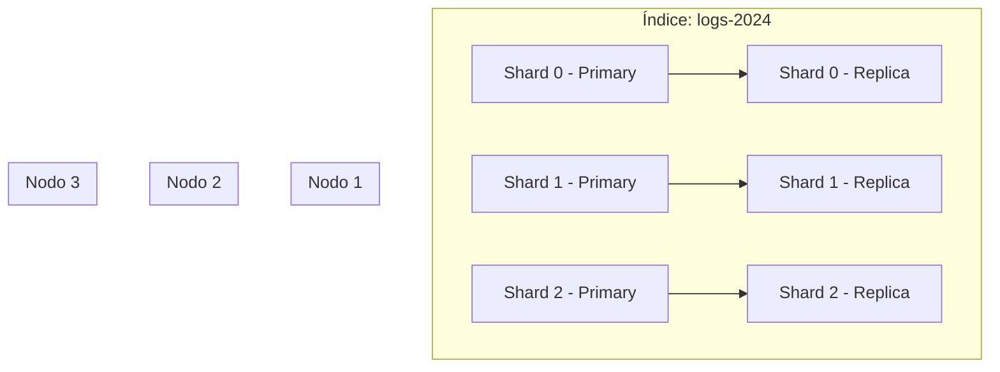

# ¿Qué es OpenSearch?

> **Opinión del autor:** OpenSearch es la mejor opción open-source para búsqueda y analítica cuando necesitas control total de tu infraestructura sin depender de licencias cambiantes. Si tu caso es solo full-text search simple con pocos datos, Meilisearch o Typesense te darán resultados más rápido con menos operación.

## Objetivo

Entender qué es OpenSearch, cómo nació, su arquitectura fundamental y los escenarios donde es la herramienta correcta — y donde no lo es.

## Prerequisitos

Ninguno. Este es el punto de partida.

## Historia: De Elasticsearch a OpenSearch

En enero de 2021, Elastic cambió la licencia de Elasticsearch de Apache 2.0 a SSPL y Elastic License. Amazon respondió creando un fork: OpenSearch, basado en Elasticsearch 7.10.2.

OpenSearch nació bajo licencia Apache 2.0. Esto garantiza que cualquier empresa puede usarlo, modificarlo y distribuirlo sin restricciones comerciales.

Desde el fork, OpenSearch ha divergido significativamente. No es solo "Elasticsearch gratis". Tiene su propio roadmap con features como Security Analytics, ML integrado y observabilidad nativa.

El proyecto pertenece a la Linux Foundation desde 2024. No es un producto de Amazon — es un proyecto comunitario con gobernanza abierta.

### OpenSearch vs Elasticsearch: Comparación de Features

La pregunta más frecuente: ¿qué tiene OpenSearch gratis que Elasticsearch cobra? Y ¿en qué han divergido desde el fork?

#### Features incluidas sin costo

| Feature | OpenSearch (Apache 2.0) | Elasticsearch (requiere licencia paid) |
|---------|------------------------|---------------------------------------|
| Seguridad (RBAC, DLS, FLS) | ✅ Incluido (Security Plugin) | ❌ Requiere licencia Platinum/Enterprise |
| Alerting | ✅ Incluido | ❌ Requiere licencia Gold+ |
| Anomaly Detection (ML) | ✅ Incluido | ❌ Requiere licencia Platinum |
| Cross-Cluster Replication | ✅ Incluido | ❌ Requiere licencia Platinum |
| Index State Management | ✅ Incluido | ⚠️ ILM incluido, pero algunas features requieren licencia |
| Observabilidad (Trace Analytics) | ✅ Incluido | ❌ Elastic APM requiere licencia |
| SQL/PPL query interface | ✅ Incluido | ⚠️ SQL básico incluido, avanzado requiere licencia |
| Búsqueda vectorial (k-NN) | ✅ Incluido | ✅ Incluido (desde 8.x) |
| Security Analytics (SIEM) | ✅ Incluido | ❌ No existe equivalente directo sin licencia |

#### Divergencias técnicas desde el fork (7.10.2)

| Área | OpenSearch 2.x | Elasticsearch 8.x |
|------|---------------|-------------------|
| Nombre del nodo maestro | `cluster_manager` | `master` (renombrado opcionalmente) |
| Motor vectorial | k-NN con Lucene/nmslib/Faiss | Dense vector con HNSW nativo |
| Pipeline de observabilidad | Data Prepper (OTEL nativo) | Elastic Agent + Fleet |
| Query language alternativo | PPL (Piped Processing Language) | ES|QL |
| Security plugin | Integrado, siempre habilitado | Módulo separado, opcional |
| ML framework | Modelos registrados en cluster | Trained models con Eland |
| Licencia | Apache 2.0 | SSPL + Elastic License |
| Gobernanza | Linux Foundation | Elastic NV (empresa) |

#### Compatibilidad de APIs

OpenSearch mantiene compatibilidad con la mayoría de APIs de Elasticsearch 7.x. Los clientes de Elasticsearch 7.x funcionan contra OpenSearch con cambios mínimos. Las diferencias principales:

- El header `X-Elastic-Product` no existe en OpenSearch. Algunos clientes oficiales de Elastic 8.x lo verifican y fallan.
- Endpoints `_security` usan el prefijo `_plugins/_security` en OpenSearch.
- Plugins de Elastic (Watcher, Graph, etc.) no existen. OpenSearch tiene equivalentes propios.

Si tu aplicación usa el SDK de Elasticsearch 7.x, la migración a OpenSearch es generalmente transparente a nivel de API.

### Migración desde Elasticsearch

Si vienes de Elasticsearch y consideras migrar a OpenSearch, estos son los paths probados.

#### Migración directa (ES 7.x → OS 2.x)

**Requisitos:**
- Elasticsearch 7.10.x o inferior (el snapshot es compatible)
- Sin plugins propietarios de Elastic (Watcher, Graph, ML con licencia)

**Procedimiento:**

1. **Snapshot del clúster ES:**
```bash
# En Elasticsearch
curl -X PUT "localhost:9200/_snapshot/migration/snap-1?wait_for_completion=true" \
  -H "Content-Type: application/json" \
  -d '{"indices": "*", "include_global_state": false}'
```

2. **Registrar el mismo repository en OpenSearch:**
```bash
# En OpenSearch (mismo bucket S3 o filesystem)
curl -sk -X PUT "https://localhost:9200/_snapshot/migration" \
  -u admin:Admin123! \
  -H "Content-Type: application/json" \
  -d '{"type": "s3", "settings": {"bucket": "mi-bucket", "region": "us-east-1"}}'
```

3. **Restaurar en OpenSearch:**
```bash
curl -sk -X POST "https://localhost:9200/_snapshot/migration/snap-1/_restore" \
  -u admin:Admin123!
```

4. **Ajustar clientes:** Cambiar URLs de Elasticsearch a OpenSearch. Si usas el SDK de ES 7.x, generalmente funciona sin cambios. Si usas ES 8.x SDK, migra al cliente de OpenSearch.

#### Migración con reindexación (ES 8.x → OS 2.x)

Para versiones de Elasticsearch superiores a 7.10, el formato de snapshot no es compatible. Usa `_reindex` remoto:

```bash
curl -sk -X POST "https://localhost:9200/_reindex" \
  -u admin:Admin123! \
  -H "Content-Type: application/json" \
  -d '{
  "source": {
    "remote": {
      "host": "http://elasticsearch-host:9200",
      "username": "elastic",
      "password": "changeme"
    },
    "index": "mi-indice"
  },
  "dest": {
    "index": "mi-indice"
  }
}'
```

#### Checklist de migración

| Paso | Acción |
|------|--------|
| 1 | Inventariar índices, templates y pipelines |
| 2 | Verificar compatibilidad de mappings (sin breaking changes en 7.x) |
| 3 | Migrar configuración de seguridad (roles, usuarios) |
| 4 | Adaptar index templates al formato composable de OS 2.x |
| 5 | Migrar ILM policies a ISM policies (formato diferente) |
| 6 | Actualizar clientes/SDKs a versiones compatibles con OpenSearch |
| 7 | Migrar dashboards de Kibana a OpenSearch Dashboards (exportar/importar Saved Objects) |
| 8 | Validar queries — 99% son compatibles, verificar edge cases |

#### Qué NO es compatible

- **Plugins propietarios de Elastic:** Watcher → usa Alerting de OS. Machine Learning → usa ML de OS. Graph → no tiene equivalente directo.
- **Kibana:** No es compatible. Usar OpenSearch Dashboards (fork de Kibana 7.10). La mayoría de dashboards se migran exportando Saved Objects.
- **Elastic Agent / Fleet:** No existe en OS. Usar Data Prepper + OTEL para observabilidad.
- **ES|QL:** No existe en OS. Usar PPL o Query DSL estándar.

## Arquitectura Fundamental

OpenSearch es un motor de búsqueda y analítica distribuido basado en Apache Lucene. Funciona como un clúster de nodos que coordinan entre sí para indexar y buscar datos.

### Nodos

Un **nodo** (node) es una instancia de OpenSearch ejecutándose. Cada nodo tiene uno o más roles:

| Rol | Función |
|-----|---------|
| Cluster manager | Gestiona el estado del clúster, asigna shards |
| Data | Almacena datos y ejecuta operaciones de búsqueda |
| Ingest | Procesa documentos antes de indexarlos |
| Coordinating | Distribuye requests y agrega resultados |
| ML | Ejecuta modelos de machine learning |

Un clúster mínimo de producción tiene al menos 3 nodos con rol cluster manager para tolerar la pérdida de uno.

### Índices y Shards

Un **índice** (index) es una colección lógica de documentos. Internamente, cada índice se divide en **shards** — fragmentos de datos distribuidos entre nodos.

Cada shard es una instancia de Lucene independiente. Los shards pueden ser primarios o réplicas. Las réplicas proveen alta disponibilidad y distribuyen la carga de lectura.



### Documentos

Los datos en OpenSearch se almacenan como documentos JSON. Cada documento pertenece a un índice y tiene un `_id` único. No hay esquema rígido por defecto — puedes indexar cualquier JSON — pero los mappings explícitos mejoran rendimiento y precisión.

## Casos de Uso

OpenSearch no es solo búsqueda de texto. Es una plataforma versátil con cuatro pilares principales.

### Búsqueda Full-Text y Semántica

El caso clásico. Indexas documentos y buscas con relevancia. OpenSearch soporta desde match queries simples hasta búsqueda vectorial con k-NN.

Escenarios típicos: buscador de e-commerce, búsqueda en documentación técnica, autocompletado con sugerencias.

### Observabilidad

Logs, métricas y traces en un solo sistema. Con Data Prepper como pipeline de ingesta y soporte nativo de OpenTelemetry (OTEL), OpenSearch compite directamente con stacks como Elastic APM o Datadog.

Escenarios típicos: centralización de logs de microservicios, dashboards operacionales, correlación de traces distribuidos.

### SIEM (Security Information and Event Management)

OpenSearch incluye Security Analytics con reglas de detección tipo Sigma, correlation engine y alerting integrado. Es una alternativa viable a Splunk para equipos con presupuesto limitado.

Escenarios típicos: detección de amenazas, cumplimiento normativo (PCI-DSS, SOC 2), investigación de incidentes.

### Analítica Operacional

Agregaciones sobre grandes volúmenes de datos en tiempo real. Ideal para dashboards de KPIs, análisis de métricas de negocio y reporting operacional con OpenSearch Dashboards.

Escenarios típicos: dashboards de ventas en tiempo real, análisis de clickstream, métricas de infraestructura.

## Por Qué Elegir OpenSearch

Estas son las razones concretas para elegir OpenSearch sobre alternativas:

1. **Licencia Apache 2.0** — Sin sorpresas legales. Puedes embeber OpenSearch en productos comerciales sin restricciones.
2. **Feature set integrado** — Seguridad, alerting, ML y observabilidad vienen incluidos. Con Elasticsearch necesitas licencias paid para funcionalidad equivalente.
3. **Compatibilidad** — APIs compatibles con Elasticsearch 7.x. La migración desde Elasticsearch es directa en la mayoría de los casos.
4. **Gobernanza abierta** — Linux Foundation. El roadmap no depende de decisiones comerciales de una sola empresa.
5. **Ecosistema maduro** — Clientes oficiales en Python, Java, Go, Node.js. Herramientas como Data Prepper y OpenSearch Dashboards cubren el ciclo completo.

## Cuándo Usar y Cuándo NO

| ✅ Usar cuando... | ❌ NO usar cuando... |
|---|---|
| Necesitas búsqueda full-text con relevancia configurable | Solo necesitas búsquedas key-value simples (usa Redis o DynamoDB) |
| Centralizas logs de múltiples servicios | Tu volumen de logs es < 1 GB/día y grep te basta |
| Requieres analítica en tiempo real sobre datos en movimiento | Necesitas transacciones ACID estrictas (usa PostgreSQL) |
| Quieres SIEM sin costo de licencia por GB ingestado | Tu equipo tiene < 2 personas para operar infraestructura de datos |
| Necesitas búsqueda vectorial junto con búsqueda de texto | Solo haces búsqueda vectorial pura sin texto (considera pgvector o Pinecone) |
| Tu organización requiere licencia Apache 2.0 por compliance | No tienes requisitos de licencia y el vendor lock-in no te preocupa |

## Ejercicios

1. **Investiga la arquitectura de tu caso:** Piensa en un proyecto actual o futuro donde podrías usar OpenSearch. Identifica cuál de los cuatro pilares (búsqueda, observabilidad, SIEM, analítica) aplicaría. Escribe en una oración qué tipo de datos indexarías y qué queries necesitas.

2. **Compara licencias:** Visita las páginas de licenciamiento de Elasticsearch (elastic.co/licensing) y OpenSearch (opensearch.org). Lista tres funcionalidades que en Elasticsearch requieren licencia paid y en OpenSearch son gratuitas. Esto te dará contexto real sobre el valor del fork.

3. **Calcula shards:** Si tienes un índice de logs que recibe 50 GB/día y quieres mantener 30 días de retención, ¿cuántos shards primarios necesitas si cada shard no debe superar 50 GB? ¿Cuántas réplicas configurarías para tolerar la pérdida de un nodo en un clúster de 3?

## Resumen

- OpenSearch es un fork de Elasticsearch 7.10.2, mantenido por la comunidad bajo Apache 2.0 y la Linux Foundation.
- Su arquitectura se basa en clústeres de nodos con datos distribuidos en shards primarios y réplicas.
- Cubre cuatro pilares: búsqueda, observabilidad, SIEM y analítica operacional.
- Incluye funcionalidades (seguridad, alerting, ML) que en Elasticsearch son de pago.
- No es la herramienta correcta para bases transaccionales, volúmenes mínimos de datos o equipos sin capacidad operacional para mantener un clúster.
