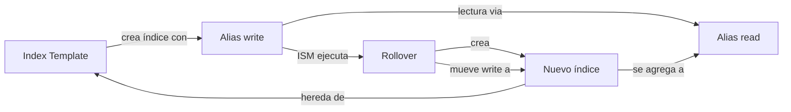

# Estrategias de Indexación

> **Opinión del autor:** La mayoría de problemas en producción con OpenSearch no vienen de queries mal escritas — vienen de una estrategia de indexación inexistente. Sin templates, sin aliases, sin ISM, terminas con índices monstruosos que no puedes rotar, no puedes archivar, y no puedes borrar sin downtime. Los cuatro conceptos de este capítulo son la diferencia entre un clúster que se gestiona solo y uno que te despierta a las 3 AM.

## Objetivo

Dominar las herramientas de gestión de índices a escala. Aprender a crear templates composables, usar aliases para desacoplar aplicaciones de índices físicos, definir políticas ISM para automatizar el ciclo de vida, y configurar rollover para rotación transparente.

## Prerequisitos

- Capítulo 4: Mappings y tipos de datos (necesarios para definir templates)
- Capítulo 5: Puente novato-intermedio (operaciones básicas de índices)

## Contenido

### Index Templates: Composable Templates

Un index template define la configuración automática que recibe todo índice nuevo cuyo nombre matchee un patrón. En OpenSearch 2.x, los templates son composables: se construyen combinando piezas reutilizables llamadas component templates.

La arquitectura tiene dos niveles:

1. **Component templates**: Piezas individuales (settings, mappings) reutilizables
2. **Composable index templates**: Combinan uno o más component templates + configuración adicional

#### Component Templates

Un component template encapsula una porción de configuración. Puedes tener uno para settings base y otro para mappings específicos.

```bash
curl -sk -X PUT https://localhost:9200/_component_template/base-settings \
  -u admin:Admin123! \
  -H "Content-Type: application/json" \
  -d '{
  "template": {
    "settings": {
      "number_of_shards": 1,
      "number_of_replicas": 1,
      "refresh_interval": "5s",
      "index.codec": "best_compression"
    }
  }
}'
```

Este component template define settings reutilizables. Cualquier index template puede incluirlo sin repetir la configuración. Si mañana cambias la compresión, la cambias en un solo lugar.

```bash
curl -sk -X PUT https://localhost:9200/_component_template/logs-mappings \
  -u admin:Admin123! \
  -H "Content-Type: application/json" \
  -d '{
  "template": {
    "mappings": {
      "properties": {
        "@timestamp": { "type": "date" },
        "message": { "type": "text", "analyzer": "standard" },
        "level": { "type": "keyword" },
        "service": { "type": "keyword" },
        "host": { "type": "keyword" },
        "trace_id": { "type": "keyword" }
      }
    }
  }
}'
```

Los mappings de logs son comunes a muchos índices. Encapsularlos en un component template evita duplicación y garantiza consistencia entre todos los índices de logs.

#### Composable Index Templates

Un composable index template referencia component templates y añade configuración específica:

```bash
curl -sk -X PUT https://localhost:9200/_index_template/logs-template \
  -u admin:Admin123! \
  -H "Content-Type: application/json" \
  -d '{
  "index_patterns": ["logs-*"],
  "priority": 100,
  "composed_of": ["base-settings", "logs-mappings"],
  "template": {
    "settings": {
      "number_of_replicas": 0
    },
    "aliases": {
      "logs-read": {}
    }
  },
  "_meta": {
    "description": "Template para índices de logs",
    "author": "opensearch-macizo"
  }
}'
```

Puntos clave de este template:

- `index_patterns`: Todo índice nuevo que matchee `logs-*` hereda esta configuración
- `priority`: Si dos templates matchean el mismo patrón, gana el de mayor prioridad
- `composed_of`: Lista ordenada de component templates a combinar
- `template`: Configuración adicional que sobreescribe lo heredado (aquí `replicas: 0` gana sobre el `1` del component)
- `_meta`: Metadata libre — documentación, autor, versión

Ahora, crear un índice `logs-2024.03.15` aplica automáticamente settings, mappings y alias sin configuración adicional.

> 📁 Código fuente: [`code/ch08/01-index-templates.sh`](../../code/ch08/01-index-templates.sh)

#### Resolución de conflictos

Cuando múltiples component templates definen el mismo campo, el orden en `composed_of` determina quién gana. El último en la lista sobreescribe al anterior. La sección `template` del index template siempre tiene la última palabra.

```
Prioridad (menor → mayor):
  component_templates[0] < component_templates[1] < ... < template del index template
```

### Aliases: Indirección Inteligente

Un alias es un nombre alternativo para uno o más índices. Parece simple, pero es la herramienta que desacopla tu aplicación de la estructura física de índices. Tu app siempre escribe en `logs-current` — no necesita saber si debajo hay uno o cien índices.

#### Alias de lectura

Un alias de lectura agrupa múltiples índices. Buscar en el alias busca en todos:

```bash
curl -sk -X POST https://localhost:9200/_aliases \
  -u admin:Admin123! \
  -H "Content-Type: application/json" \
  -d '{
  "actions": [
    { "add": { "index": "logs-2024.03.01", "alias": "logs-marzo" } },
    { "add": { "index": "logs-2024.03.02", "alias": "logs-marzo" } },
    { "add": { "index": "logs-2024.03.03", "alias": "logs-marzo" } }
  ]
}'
```

Buscar en `logs-marzo` equivale a buscar en los tres índices simultáneamente. La aplicación no sabe ni le importa cuántos índices hay debajo.

#### Alias de escritura (write index)

Un alias puede tener un solo write index — el índice donde van los documentos nuevos:

```bash
curl -sk -X POST https://localhost:9200/_aliases \
  -u admin:Admin123! \
  -H "Content-Type: application/json" \
  -d '{
  "actions": [
    {
      "add": {
        "index": "logs-2024.03.03",
        "alias": "logs-current",
        "is_write_index": true
      }
    },
    {
      "add": {
        "index": "logs-2024.03.01",
        "alias": "logs-current"
      }
    },
    {
      "add": {
        "index": "logs-2024.03.02",
        "alias": "logs-current"
      }
    }
  ]
}'
```

Las reglas son claras: solo un índice puede ser `is_write_index: true` por alias. Las escrituras al alias van siempre a ese índice. Las lecturas buscan en todos los índices del alias.

#### Alias con filtro

Puedes crear un alias que solo exponga un subconjunto de documentos:

```bash
curl -sk -X POST https://localhost:9200/_aliases \
  -u admin:Admin123! \
  -H "Content-Type: application/json" \
  -d '{
  "actions": [
    {
      "add": {
        "index": "logs-2024.03.*",
        "alias": "logs-errores",
        "filter": { "term": { "level": "ERROR" } }
      }
    }
  ]
}'
```

Buscar en `logs-errores` aplica automáticamente el filtro `level: ERROR`. Es multitenancy sin partición física — un alias por tenant, cada uno con su filtro.

#### Swap atómico

La operación más poderosa: mover un alias de un índice a otro sin downtime:

```bash
curl -sk -X POST https://localhost:9200/_aliases \
  -u admin:Admin123! \
  -H "Content-Type: application/json" \
  -d '{
  "actions": [
    { "remove": { "index": "productos-v1", "alias": "productos" } },
    { "add":    { "index": "productos-v2", "alias": "productos" } }
  ]
}'
```

Las dos acciones se ejecutan en una sola transacción atómica. No hay momento donde `productos` no exista. Esto habilita reindexación sin downtime: creas el nuevo índice, reindexas, y swapeas el alias.

> 📁 Código fuente: [`code/ch08/02-aliases.sh`](../../code/ch08/02-aliases.sh)

### Index State Management (ISM)

ISM es el sistema de políticas de OpenSearch para automatizar el ciclo de vida de índices. Defines estados (hot, warm, cold, delete) con acciones y transiciones — OpenSearch ejecuta todo automáticamente.

#### Anatomía de una ISM Policy

Una policy tiene tres componentes:

1. **States**: Estados por los que pasa el índice (hot, warm, delete)
2. **Actions**: Qué hacer en cada estado (rollover, force_merge, delete)
3. **Transitions**: Condiciones para pasar al siguiente estado (edad, tamaño, cantidad de docs)

```bash
curl -sk -X PUT https://localhost:9200/_plugins/_ism/policies/logs-lifecycle \
  -u admin:Admin123! \
  -H "Content-Type: application/json" \
  -d '{
  "policy": {
    "description": "Ciclo de vida: hot → warm → delete",
    "default_state": "hot",
    "ism_template": [
      {
        "index_patterns": ["logs-*"],
        "priority": 100
      }
    ],
    "states": [
      {
        "name": "hot",
        "actions": [
          {
            "rollover": {
              "min_size": "10gb",
              "min_doc_count": 5000000,
              "min_index_age": "1d"
            }
          }
        ],
        "transitions": [
          {
            "state_name": "warm",
            "conditions": { "min_index_age": "2d" }
          }
        ]
      },
      {
        "name": "warm",
        "actions": [
          { "replica_count": { "number_of_replicas": 0 } },
          { "force_merge": { "max_num_segments": 1 } }
        ],
        "transitions": [
          {
            "state_name": "delete",
            "conditions": { "min_index_age": "30d" }
          }
        ]
      },
      {
        "name": "delete",
        "actions": [ { "delete": {} } ],
        "transitions": []
      }
    ]
  }
}'
```

El flujo: un índice nace en estado `hot`, recibe escrituras. Cuando cumple 2 días, pasa a `warm` donde se compacta y pierde réplicas. A los 30 días se elimina automáticamente. Sin intervención humana.

> 📁 Código fuente: [`code/ch08/03-ism-policy.sh`](../../code/ch08/03-ism-policy.sh)

#### ism_template: Asociación Automática

El campo `ism_template` dentro de la policy asocia automáticamente la política a índices nuevos que matcheen el patrón. No necesitas aplicar la policy manualmente a cada índice:

```json
"ism_template": [
  {
    "index_patterns": ["logs-*"],
    "priority": 100
  }
]
```

Para índices que ya existían antes de crear la policy, aplícala manualmente:

```bash
curl -sk -X POST https://localhost:9200/_plugins/_ism/add/logs-existente \
  -u admin:Admin123! \
  -H "Content-Type: application/json" \
  -d '{ "policy_id": "logs-lifecycle" }'
```

#### Acciones ISM disponibles

| Acción | Uso |
|--------|-----|
| `rollover` | Crear nuevo índice cuando se cumplen condiciones |
| `force_merge` | Compactar segmentos para lectura eficiente |
| `replica_count` | Ajustar réplicas (0 en warm ahorra disco) |
| `read_only` | Bloquear escrituras |
| `shrink` | Reducir número de shards |
| `snapshot` | Crear snapshot antes de eliminar |
| `notification` | Enviar alerta a webhook/email |
| `delete` | Eliminar el índice |
| `close` | Cerrar el índice (libera memoria, mantiene datos) |
| `open` | Reabrir un índice cerrado |

#### Monitoreo de ISM

Verifica el estado actual de un índice bajo ISM:

```bash
curl -sk https://localhost:9200/_plugins/_ism/explain/logs-*  \
  -u admin:Admin123!
```

La respuesta muestra: estado actual, acción en progreso, siguiente transición, y errores si los hay.

> 📁 Código fuente: [`code/ch08/ism-policy.json`](../../code/ch08/ism-policy.json)

### Rollover: Rotación Transparente

Rollover crea un nuevo índice y mueve el alias de escritura automáticamente. Es el mecanismo que permite que tu aplicación escriba siempre en el mismo alias mientras OpenSearch gestiona la creación de índices nuevos.

#### Setup para Rollover

El rollover requiere tres piezas:

1. Un índice inicial con sufijo numérico (`-000001`)
2. Un alias de escritura (`is_write_index: true`)
3. Una condición de rotación (tamaño, documentos, o edad)

```bash
curl -sk -X PUT https://localhost:9200/events-000001 \
  -u admin:Admin123! \
  -H "Content-Type: application/json" \
  -d '{
  "aliases": {
    "events-write": { "is_write_index": true },
    "events-read": {}
  }
}'
```

La convención `-000001` no es estética. OpenSearch incrementa este número automáticamente en cada rollover: `-000002`, `-000003`, etc.

#### Rollover Manual

Ejecutas el rollover contra el alias de escritura:

```bash
curl -sk -X POST https://localhost:9200/events-write/_rollover \
  -u admin:Admin123! \
  -H "Content-Type: application/json" \
  -d '{
  "conditions": {
    "max_docs": 1000000,
    "max_age": "1d",
    "max_size": "10gb"
  }
}'
```

Si al menos una condición se cumple:

1. OpenSearch crea `events-000002` con la configuración del template
2. Mueve `events-write` al nuevo índice (`is_write_index: true`)
3. Agrega `events-read` al nuevo índice (lectura ve todos)
4. El índice anterior queda de solo lectura en la práctica

Si ninguna condición se cumple, la respuesta incluye `"rolled_over": false`.

#### Rollover Automático con ISM

En producción nadie ejecuta rollover a mano. ISM lo gestiona. Combinas la acción `rollover` en el estado `hot` de tu policy:

```json
{
  "name": "hot",
  "actions": [
    {
      "rollover": {
        "min_size": "10gb",
        "min_doc_count": 1000000,
        "min_index_age": "1d"
      }
    }
  ],
  "transitions": [
    {
      "state_name": "warm",
      "conditions": { "min_index_age": "7d" }
    }
  ]
}
```

ISM evalúa las condiciones periódicamente (por defecto cada 5 minutos, configurable con `plugins.index_state_management.job_interval`). Cuando una condición se cumple, ejecuta el rollover y transiciona el índice.

#### Patrón completo: Template + Alias + ISM + Rollover

Las cuatro piezas trabajan juntas:



1. El **template** define mappings, settings, y aliases automáticos
2. Los **aliases** desacoplan la aplicación de índices físicos
3. **ISM** evalúa condiciones y ejecuta acciones automáticamente
4. **Rollover** crea nuevos índices y rota el alias de escritura

Tu aplicación solo conoce dos nombres: `events-write` para escribir, `events-read` para leer. Nunca necesita saber que debajo hay `events-000001`, `events-000002`, ... `events-000047`.

> 📁 Código fuente: [`code/ch08/04-rollover.sh`](../../code/ch08/04-rollover.sh)

### Configuración como Código (GitOps)

En producción, no ejecutas scripts manualmente. Defines tu estrategia de indexación en archivos YAML versionados en Git y la despliegas con CI/CD. Este patrón garantiza reproducibilidad y auditoría de cambios.

Un archivo YAML declara templates, policies y aliases de forma legible:

```yaml
# Configuración ISM declarativa
cluster_settings:
  plugins.index_state_management.enabled: true
  plugins.index_state_management.job_interval: 5

component_templates:
  - name: base-settings
    template:
      settings:
        number_of_shards: 1
        number_of_replicas: 1
        refresh_interval: "5s"
        index.codec: best_compression

  - name: logs-mappings
    template:
      mappings:
        properties:
          "@timestamp":
            type: date
          message:
            type: text
          level:
            type: keyword
          service:
            type: keyword

index_templates:
  - name: logs-template
    index_patterns:
      - "logs-*"
    priority: 100
    composed_of:
      - base-settings
      - logs-mappings

ism_policies:
  - name: logs-lifecycle
    policy:
      default_state: hot
      states:
        - name: hot
          actions:
            - rollover:
                min_size: "10gb"
                min_index_age: "1d"
          transitions:
            - state_name: warm
              conditions:
                min_index_age: "2d"
        - name: warm
          actions:
            - force_merge:
                max_num_segments: 1
          transitions:
            - state_name: delete
              conditions:
                min_index_age: "30d"
        - name: delete
          actions:
            - delete: {}
          transitions: []
```

Un script de despliegue lee el YAML y ejecuta las llamadas REST correspondientes. En tu pipeline CI/CD, corres el script en cada merge a main — los cambios en estrategia de indexación pasan por code review igual que cualquier cambio de código.

> 📁 Código fuente: [`code/ch08/05-ism-config.yml`](../../code/ch08/05-ism-config.yml)

> 📁 Código fuente: [`code/ch08/06-deploy-config.sh`](../../code/ch08/06-deploy-config.sh)

## Cuándo Usar y Cuándo NO

| ✅ Usar cuando... | ❌ NO usar cuando... |
|---|---|
| **Index Templates** | |
| Creas índices con patrón predecible (logs-*, metrics-*) | Tienes un solo índice que nunca cambia |
| Necesitas consistencia de mappings entre múltiples índices | Cada índice tiene schema completamente diferente |
| Quieres automatizar alias y settings en índices nuevos | Prototipos rápidos donde el schema es experimental |
| **Aliases** | |
| Tu aplicación necesita desacoplarse de índices físicos | Acceso directo a un índice específico para admin |
| Necesitas reindexar sin downtime (swap atómico) | El rendimiento de una indirección extra no es aceptable |
| Quieres vistas filtradas de los mismos datos (multitenancy) | Tienes un solo consumidor con un solo índice |
| **ISM** | |
| Datos con ciclo de vida claro (hot/warm/cold/delete) | Datos que necesitas retener indefinidamente sin cambios |
| Quieres automatizar compactación, archivado, eliminación | Clúster de desarrollo donde borras manualmente |
| Operas decenas o cientos de índices | Tienes 2-3 índices estáticos |
| **Rollover** | |
| Flujo continuo de datos (logs, métricas, eventos) | Índices estáticos que se llenan una vez |
| Necesitas controlar el tamaño de shards | Datos con volumen bajo y predecible |
| Quieres combinar con ISM para gestión automática | Aplicaciones CRUD donde actualizas documentos existentes |

## Ejercicios

1. **Templates composables**: Crea dos component templates — uno con settings (2 shards, codec zstd) y otro con mappings para métricas (campos: `@timestamp`, `metric_name`, `value`, `host`). Combínalos en un index template para el patrón `metrics-*`. Crea un índice `metrics-2024.03.15` y verifica que heredó la configuración.

2. **Aliases con filtro**: Crea un índice `app-logs` con 10 documentos (5 con `level: INFO`, 3 con `level: WARN`, 2 con `level: ERROR`). Crea tres aliases con filtro: `app-logs-info`, `app-logs-warn`, `app-logs-errors`. Verifica que buscar en cada alias solo devuelve los documentos del nivel correspondiente.

3. **ISM policy custom**: Diseña una ISM policy llamada `metrics-lifecycle` con 4 estados: `hot` (rollover a 5GB o 1 día), `warm` (force_merge a 1 segmento, 0 réplicas), `cold` (close del índice a los 14 días), `delete` (eliminación a los 90 días). Aplícala a un índice de prueba y verifica con `_plugins/_ism/explain`.

4. **Rollover end-to-end**: Configura un flujo completo: crea un template para `audit-*`, crea el índice inicial `audit-000001` con alias de escritura, indexa documentos hasta disparar un rollover (usa `max_docs: 3` para la demo). Verifica que después del rollover, el alias de lectura cubre ambos índices y la escritura va al nuevo.

## Resumen

- Los **component templates** encapsulan piezas de configuración reutilizables (settings, mappings)
- Los **composable index templates** combinan component templates con prioridad y patrones de nombres
- Los **aliases** desacoplan tu aplicación de los índices físicos — habilitan swap atómico y vistas filtradas
- Un alias puede tener un solo **write index** donde van las escrituras
- **ISM** automatiza el ciclo de vida: define estados, acciones, y condiciones de transición
- **Rollover** crea índices nuevos y rota el alias de escritura cuando se cumplen condiciones
- En producción, ISM ejecuta rollover automáticamente — nunca lo hagas manualmente en un flujo real
- El patrón completo (template + alias + ISM + rollover) es la base de cualquier arquitectura de logs o métricas a escala
