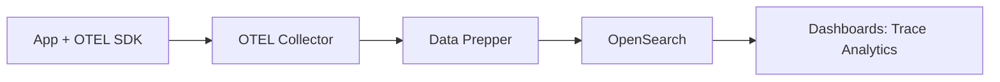

# Observabilidad con OTEL

> **Opinión del autor:** OpenSearch como backend de observabilidad es subestimado. Con Data Prepper + OTEL, reemplazas la combinación de Elastic APM + Jaeger + herramientas de logs por un solo stack. Menos vendors, menos integraciones rotas, un solo query language para logs, traces y métricas. Si ya tienes OpenSearch para búsqueda, agregar observabilidad es incrementar uso de infraestructura existente.

## Objetivo

Implementar un stack de observabilidad completo con OpenSearch: logs, traces y métricas usando Data Prepper como pipeline de ingesta y OpenTelemetry como estándar de instrumentación.

## Prerequisitos

- Capítulo 13: Arquitectura de producción (clúster multi-nodo)
- Conocimiento básico de qué son logs, traces y métricas

## Contenido

### Los Tres Pilares

| Pilar | Qué responde | Formato en OpenSearch |
|-------|-------------|---------------------|
| Logs | ¿Qué pasó? | Documentos con timestamp + message |
| Traces | ¿Por dónde pasó el request? | Spans con trace_id + span_id |
| Métricas | ¿Cómo se comporta el sistema? | Series temporales con valores numéricos |

### Arquitectura: OTEL + Data Prepper + OpenSearch



- **OTEL SDK**: Instrumentación en tu app (auto o manual)
- **OTEL Collector**: Recibe, procesa y exporta telemetría
- **Data Prepper**: Pipeline que transforma datos OTEL al formato OpenSearch
- **OpenSearch**: Almacena y permite buscar logs, traces y métricas
- **Dashboards**: Visualización con Trace Analytics plugin

### Data Prepper: Configuración

Data Prepper es un pipeline de datos open-source optimizado para OpenSearch. Se configura con YAML:

```yaml
# data-prepper-config.yaml
log-pipeline:
  source:
    otel_logs_source:
      port: 21892
  processor:
    - date:
        from_time_received: true
        destination: "@timestamp"
  sink:
    - opensearch:
        hosts: ["https://opensearch-node1:9200"]
        username: "admin"
        password: "Admin123!"
        insecure: true
        index: "otel-logs-%{yyyy.MM.dd}"

trace-pipeline:
  source:
    otel_trace_source:
      port: 21890
  processor:
    - otel_trace_raw:
    - otel_trace_group:
        hosts: ["https://opensearch-node1:9200"]
        username: "admin"
        password: "Admin123!"
        insecure: true
  sink:
    - opensearch:
        hosts: ["https://opensearch-node1:9200"]
        username: "admin"
        password: "Admin123!"
        insecure: true
        index_type: "trace-analytics-raw"

metrics-pipeline:
  source:
    otel_metrics_source:
      port: 21891
  processor:
    - otel_metrics:
        calculate_histogram_buckets: true
  sink:
    - opensearch:
        hosts: ["https://opensearch-node1:9200"]
        username: "admin"
        password: "Admin123!"
        insecure: true
        index: "otel-metrics-%{yyyy.MM.dd}"
```

Cada pipeline tiene tres componentes: source (de dónde vienen los datos), processor (transformaciones), y sink (dónde van).

> 📁 Código fuente: [`code/ch15/data-prepper-config.yaml`](../../code/ch15/data-prepper-config.yaml)

### Docker Compose con Data Prepper

Extender el laboratorio para incluir Data Prepper:

```yaml
# Agregar a docker-compose.yml
  data-prepper:
    image: opensearchproject/data-prepper:2.6.1
    volumes:
      - ./ch15/data-prepper-config.yaml:/usr/share/data-prepper/pipelines/pipelines.yaml
    ports:
      - "21890:21890"  # traces
      - "21891:21891"  # metrics
      - "21892:21892"  # logs
    depends_on:
      opensearch-node1:
        condition: service_healthy
```

> 📁 Código fuente: [`code/ch15/docker-compose-observability.yml`](../../code/ch15/docker-compose-observability.yml)

### Enviar Traces con OTEL

Un ejemplo mínimo con el OTEL SDK de Python:

```python
from opentelemetry import trace
from opentelemetry.exporter.otlp.proto.grpc.trace_exporter import OTLPSpanExporter
from opentelemetry.sdk.trace import TracerProvider
from opentelemetry.sdk.trace.export import BatchSpanProcessor

# Configurar exportador hacia Data Prepper
exporter = OTLPSpanExporter(endpoint="http://localhost:21890", insecure=True)
provider = TracerProvider()
provider.add_span_processor(BatchSpanProcessor(exporter))
trace.set_tracer_provider(provider)

# Crear spans
tracer = trace.get_tracer("opensearch-macizo-demo")
with tracer.start_as_current_span("process-order") as span:
    span.set_attribute("order.id", "ORD-12345")
    with tracer.start_as_current_span("validate-payment"):
        pass  # lógica de validación
    with tracer.start_as_current_span("update-inventory"):
        pass  # lógica de inventario
```

Los spans se envían a Data Prepper vía gRPC, que los procesa y almacena en OpenSearch con el formato de Trace Analytics.

> 📁 Código fuente: [`code/ch15/send-traces.py`](../../code/ch15/send-traces.py)

### Trace Analytics en Dashboards

OpenSearch Dashboards incluye el plugin Trace Analytics que visualiza:

- **Service map**: Grafo de dependencias entre servicios
- **Traces**: Lista de traces con latencia, errores y spans
- **Service details**: Latencia P50/P95/P99 por servicio

Accede desde Dashboards → Observability → Trace Analytics.

### Métricas con OTEL

Data Prepper recibe métricas OTEL y las almacena como documentos indexables:

```json
{
  "@timestamp": "2024-03-15T10:30:00Z",
  "metric_name": "http_request_duration_seconds",
  "value": 0.245,
  "attributes": {
    "method": "GET",
    "path": "/api/products",
    "status_code": "200"
  },
  "resource": {
    "service.name": "api-gateway"
  }
}
```

Puedes hacer aggregations y date_histograms sobre métricas igual que sobre cualquier documento. No necesitas un sistema de métricas separado.

## Cuándo Usar y Cuándo NO

| ✅ Usar OpenSearch para observabilidad... | ❌ NO usar cuando... |
|---|---|
| Ya tienes OpenSearch en tu stack | Tu organización ya usa Datadog/New Relic y el costo no es problema |
| Necesitas correlacionar logs + traces + métricas en un solo sistema | Necesitas métricas de alta frecuencia (< 1s intervals) con retención de años |
| Tu equipo domina el Query DSL para debugging | Tu equipo no tiene capacidad de operar Data Prepper |
| Quieres evitar vendor lock-in con OTEL como estándar | El volumen de telemetría excede la capacidad de tu clúster OpenSearch |

## Ejercicios

1. Levanta Data Prepper con la configuración de ejemplo y envía 10 spans desde un script Python. Verifica que aparecen en el índice `otel-v1-apm-span-*` usando la REST API.

2. Configura un pipeline de logs que reciba OTEL logs y los almacene en `otel-logs-YYYY.MM.DD`. Envía 5 log records y búscalos por severity level.

3. Accede a Trace Analytics en Dashboards y explora el service map generado por los traces del ejercicio 1.

## Resumen

- OpenSearch + Data Prepper + OTEL forma un stack de observabilidad completo y open-source
- Data Prepper tiene pipelines independientes para logs, traces y métricas
- OTEL SDK instrumenta tu app; OTEL Collector normaliza; Data Prepper transforma para OpenSearch
- Trace Analytics en Dashboards visualiza service maps, latencias y errores
- Las métricas se almacenan como documentos — búscalas con el mismo Query DSL de siempre
- Un solo backend para los tres pilares reduce complejidad operativa
